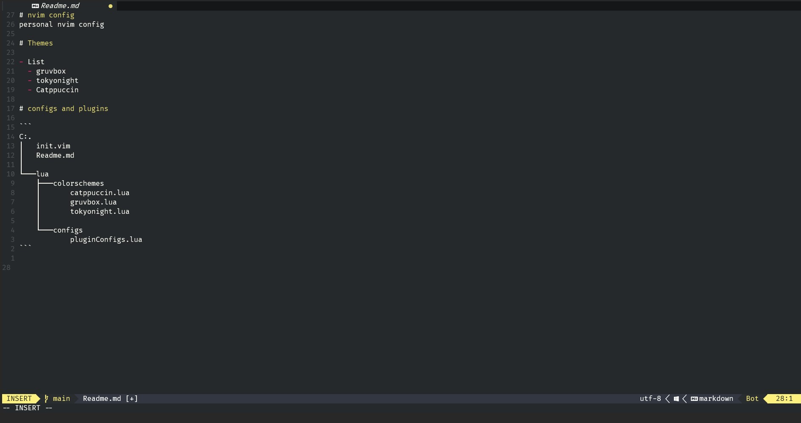

# nvim config
personal nvim config

# Themes

- List
  - gruvbox
  - tokyonight
  - Catppuccin

# configs and plugins

``` 
C:.
│   init.vim
│   Readme.md
│
└───lua
    ├───colorschemes
    │       catppuccin.lua
    │       gruvbox.lua
    │       tokyonight.lua
    │
    └───configs
            pluginConfigs.lua
```
# screenshots


